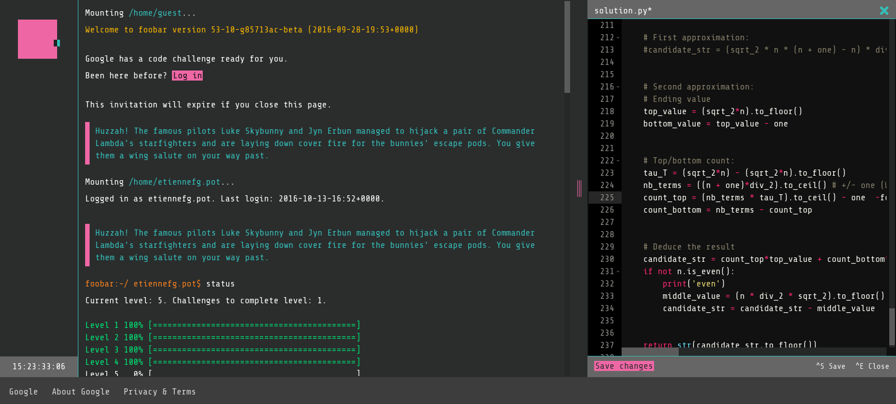
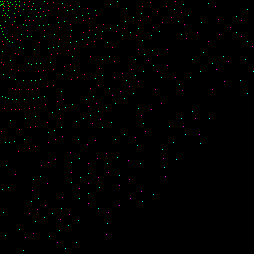
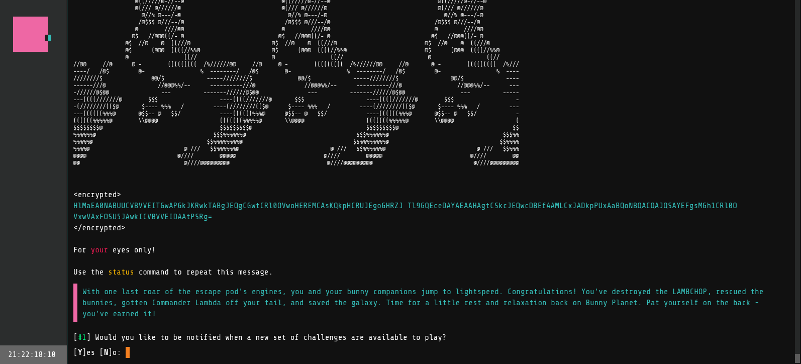

# Google Foobar

I've got the chance to received an invitation for [Google Foobar](https://foobar.withgoogle.com/) few month ago. I'll probably never been contacted anymore so I share the code I submitted back then. After completing the challenges, here are some though about it.

The challenges are more or less difficult, except for the last level which is definitely one step above all others (they let you 22 days to solve this challenge). Each solution can be done using either Java or Python. In my opinion people how choose Python have a big advantage over those how keep Java. In addition to that fact that prototyping is much faster with Python due to the less verbose (and more permissive) syntax, Java would require to re-program features otherwise available in the Python standard library (the fact that the `itertools` or `fractions` modules were allowed was quite convenient).

Usually, the solution can be found by starting from a brut-force algorithm and optimizing on top of that (sometimes require refactoring). The brut-force implementation help to better understand the problem and generate some data to find a pattern. For some problems, some data visualization really helped to discover patterns and made the challenge much easier.

While I was completing level 5 I triggered Foobar again. It don't change anything but gives you the possibility to do launch two challenges at the same time. If you want to try, here are the keywords which can trigger the challenge. I also think that being located in the US and more specifically in the bay area help:
 * python list comprehension
 * dependencies injection

I'm sure there are other queries (I've heard that something related to hashmap, pthread, try catch can also work) but those are the two which worked for me. Be careful and wait a few second (something like 2s) to gives enough time for the message to appear. I think I missed another opportunity one year ago when I closed the page while the message was appearing.

After completing the last level, you get some message encrypted in base64, maybe with PGP. I'm not sure if everyone get the same message though.

